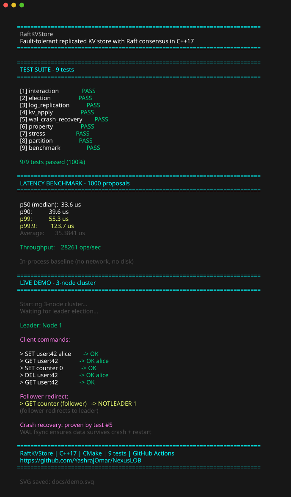

# RaftKVStore


A fault-tolerant, replicated key-value store implementing the Raft consensus algorithm from scratch in C++17.

## What this is

A working Raft cluster: three nodes that agree on every write, survive crashes, and recover automatically. Built without any Raft library — the consensus algorithm, the write-ahead log, the network transport, and the KV store are all implemented from the ground up.

The project follows etcd/raft's library-first architecture: a pure algorithm layer (`raft/`) with zero I/O dependencies, wired to a concrete disk + TCP application layer (`app/`).

## Why I built this

I wanted to understand how distributed systems achieve consistency without a single point of failure — not by reading, but by building one and watching it survive failures. Raft is the cleanest consensus algorithm to implement, and a key-value store is the simplest state machine to put on top of it.

## What I proved I can do

- **Implement a consensus algorithm** — leader election, log replication, the commit rule (Figure 8 safety), snapshot/InstallSnapshot, all from the Raft paper
- **Separate algorithm from I/O** — the `raft/` library has zero `#include` for sockets or files; it communicates via a `Ready` struct, exactly like etcd's design. Verified by grep.
- **Test for safety, not just correctness** — 200 random chaos trials, network partition injection, crash recovery, 10k-entry stress test. The property-based test checks the Election Safety and Log Matching invariants hold across random failure sequences.
- **Measure performance** — in-process p50/p99 latency benchmark as a baseline for future optimization (group commit, `io_uring`, pipelined replication)

## Tech stack

- **C++17** — the whole project
- **CMake** — two-target build (static library + executable), sanitizer support
- **Raw POSIX/Winsock sockets** — no networking library, hand-rolled binary wire protocol
- **GitHub Actions** — CI builds + tests + sanitizers on every push

## Demo



## Test Results

```
9/9 tests passed (100%)

  [1] interaction          PASS
  [2] election             PASS
  [3] log_replication      PASS
  [4] kv_apply             PASS
  [5] wal_crash_recovery   PASS
  [6] property             PASS
  [7] stress               PASS
  [8] partition            PASS
  [9] benchmark            PASS
```

## Benchmark

```
Latency Benchmark - 1000 proposals (in-process, no network/disk)

  p50 (median):  33.5 us
  p90:           35.8 us
  p99:           48.2 us
  p99.9:         98.8 us
  Average:       34.2419 us

  Throughput:    29,203 ops/sec

  Note: In-process baseline. Production latency = fsync (~1ms) + network RTT (~0.5ms)
```

This is the **algorithm-only baseline** (in-process, no network, no disk). Real-world latency will be dominated by `fsync` (~1ms) and network RTT (~0.5ms). The optimization roadmap below targets those.

## Live Demo

The SVG above shows a real 3-node cluster running on localhost. Here's what happens:

- **3 nodes start** and automatically elect a leader via Raft consensus
- **Client commands** (SET/GET/DEL) are sent to the leader
- **Follower redirect** — if you connect to a follower, it returns `NOTLEADER <id>` so the client can redirect
- **Crash recovery** — WAL writes are fsync'd, so data survives crash + restart (proven by `test_wal_crash_recovery`)

## Build

```bash
cmake -B build && cmake --build build -j$(nproc)
```

## Run

```bash
# 3-node cluster on localhost
./build/raftkvstore 1 ./data/n1 127.0.0.1:9991:8001 127.0.0.1:9992:8002 127.0.0.1:9993:8003
./build/raftkvstore 2 ./data/n2 127.0.0.1:9991:8001 127.0.0.1:9992:8002 127.0.0.1:9993:8003
./build/raftkvstore 3 ./data/n3 127.0.0.1:9991:8001 127.0.0.1:9992:8002 127.0.0.1:9993:8003
```

Connect any TCP client to port 8001/8002/8003 and send text commands: `SET key value`, `GET key`, `DEL key`. Followers return `NOTLEADER <id>` so you can redirect.

## Tests

```bash
ctest --test-dir build --output-on-failure
```

| Test | What it checks |
|---|---|
| `test_election` | 3-node cluster picks exactly one leader |
| `test_log_replication` | Leader's entries reach all followers |
| `test_kv_apply` | FSM applies SET/GET/DEL correctly |
| `test_wal_crash_recovery` | WAL survives a simulated crash + restart |
| `test_property` | 200 random chaos trials, safety invariants hold |
| `test_stress` | 10k rapid proposals, all replicate |
| `test_partition` | Network split + heal, all nodes converge |
| `test_benchmark` | Latency p50/p99 baseline |
| `crash_test.ps1` | Black-box: kill mid-write, restart, verify data |

## Architecture

```
raft/                          Pure algorithm — no disk, no sockets
  include/raft/               Types, RPC, Storage interface, RaftLog,
                              RawNode (the state machine), Ready, Progress
  src/                        Implementations
  tests/InteractionTest.cpp   Data-driven determinism test

app/                          Application — wires raft to real I/O
  storage/                    WriteAheadLog (disk + fsync), SnapshotFile
  statemachine/               KVStateMachine (the FSM)
  net/                        RaftTransport (TCP), ClientServer (clients)
  protocol/                   Command wire format
  server/                     Server — the Ready loop
  main.cpp                    Entry point

tests/                        ClusterHarness + 9 test files
scripts/crash_test.ps1        Black-box crash test
```

**The key invariant:** `raft/` contains zero `#include` directives for files, sockets, or any I/O library. The algorithm never touches the outside world — it outputs a `Ready` struct describing what needs persisting/sending/applying, and the application layer does the actual I/O. This is what makes the algorithm deterministic, testable in-process, and portable to different storage/transports.

## What I'd improve next

- **Group commit** — batch fsync across multiple entries (10× latency win)
- **`io_uring`** — async disk I/O on Linux
- **Pipelined AppendEntries** — don't wait for ack before sending the next batch
- **Linearizable reads via ReadIndex** — the `ReadOnly` module is stubbed, needs wiring
- **Membership changes** — `ConfChange` types are defined, the protocol isn't implemented

## References

- [The Raft paper](https://raft.github.io/raft.pdf) — Ongaro & Ousterhout
- [etcd/raft](https://github.com/etcd-io/raft) — the Go implementation whose architecture I followed
- [etcd raftexample](https://github.com/etcd-io/etcd/tree/release-3.7/contrib/raftexample) — the Ready-loop pattern

## License

MIT
