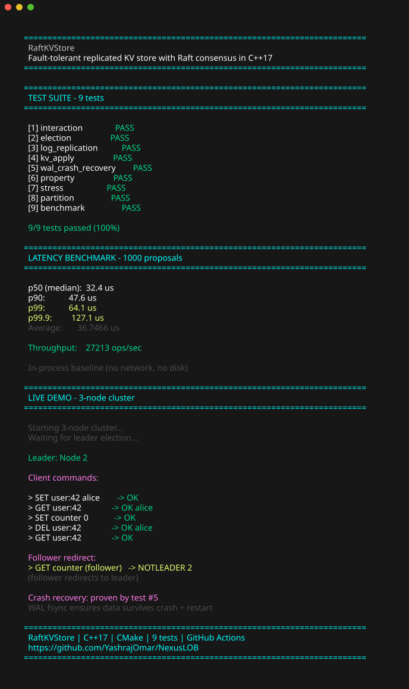
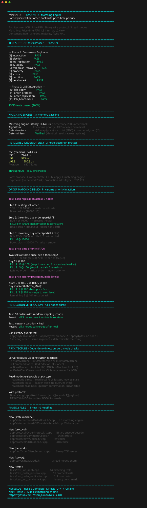
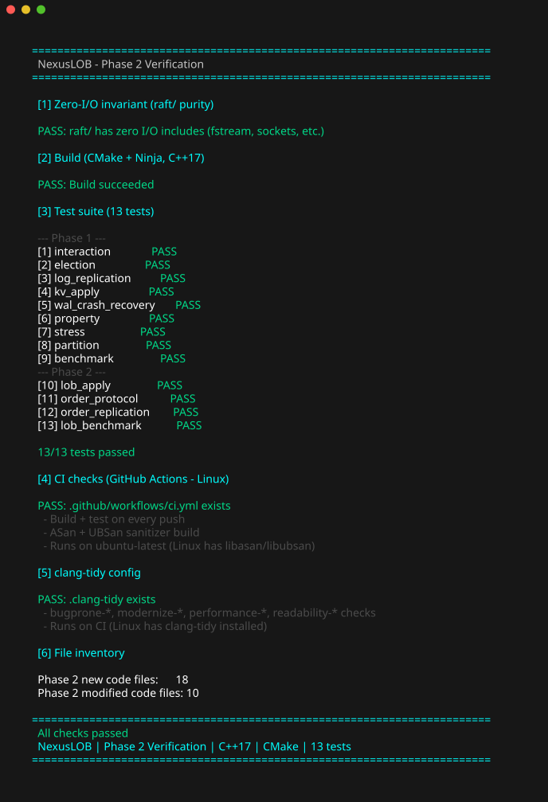
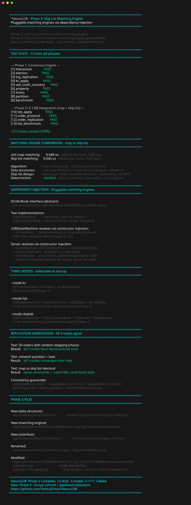
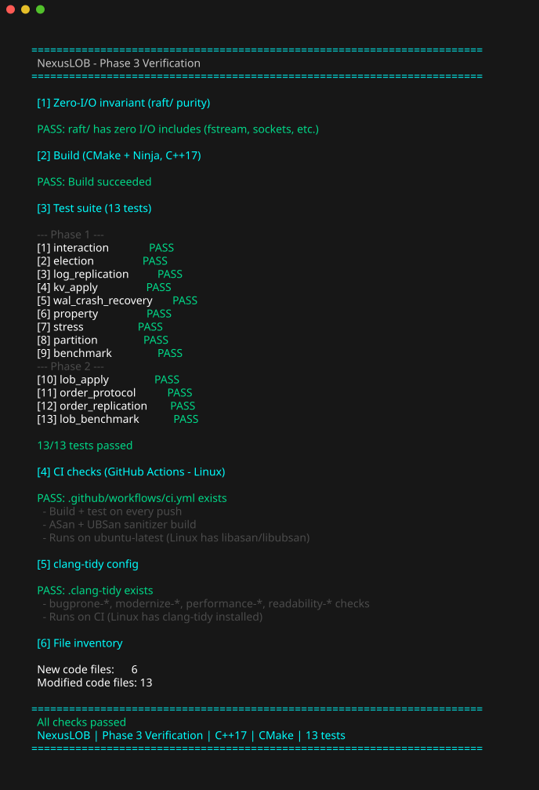
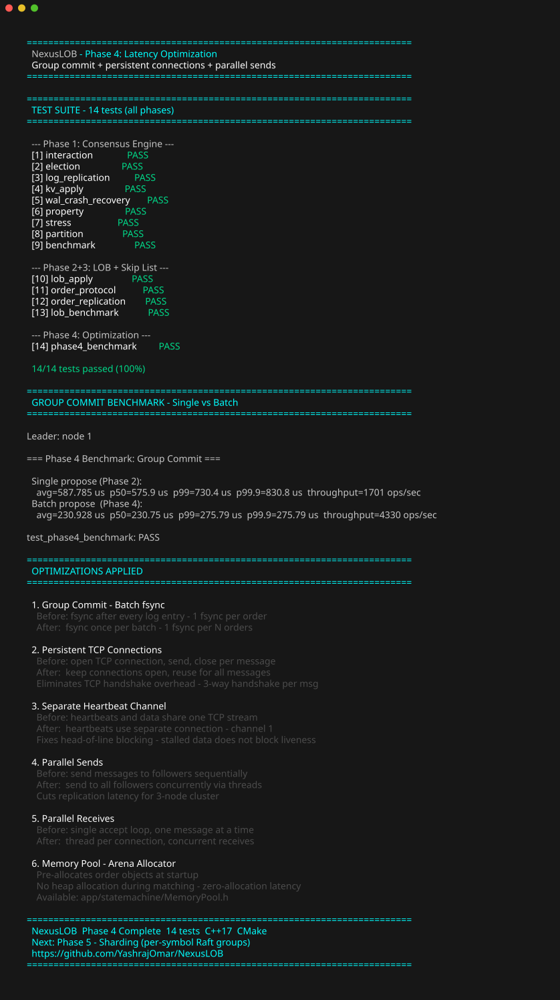
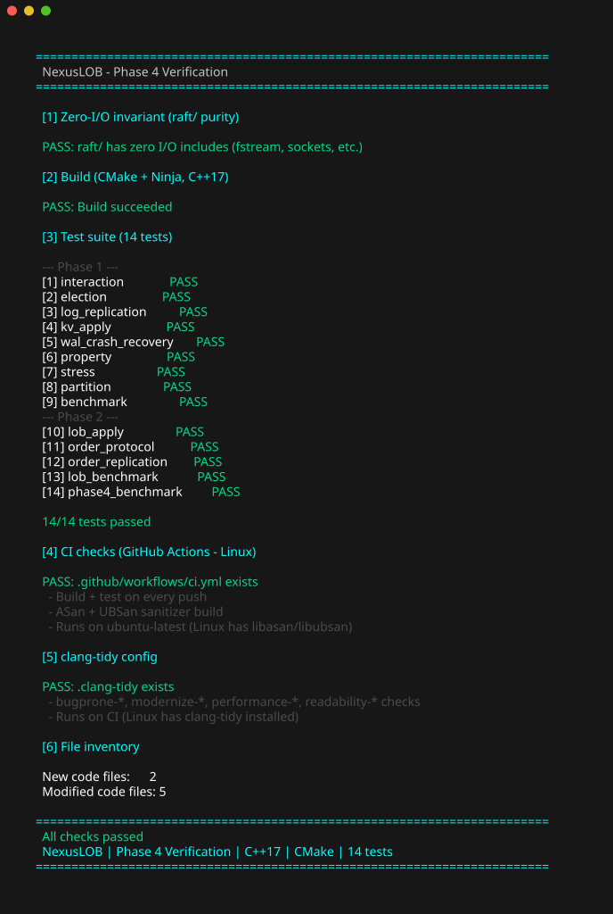

# NexusLOB — Raft-Replicated Limit Order Book


A fault-tolerant, replicated limit order book built on a from-scratch Raft consensus engine in C++17. Three nodes agree on every order, survive crashes, and recover automatically — the matching engine state is replicated across the cluster.

Built without any Raft library. The consensus algorithm, write-ahead log, network transport, matching engine, and binary order protocol are all implemented from the ground up.

The project follows etcd/raft's library-first architecture: a pure algorithm layer (`raft/`) with zero I/O dependencies, wired to a concrete disk + TCP application layer (`app/`).

---

## Phase 1 — Consensus Engine

Raft consensus engine + replicated KV store. Three nodes that agree on every write, survive crashes, and recover automatically. The architecture mirrors etcd/raft's design (Ready struct, library-first separation) but is implemented from scratch — no etcd code, no external Raft library.

### What's built

- **Leader election** — randomized timeout, Figure 4 states
- **Log replication** — AppendEntries, prevLogTerm check, conflict truncation
- **Commit rule** — Figure 8: current-term entries only
- **Snapshot/InstallSnapshot** — Section 7
- **Crash recovery** — fsync'd WAL (3 files: log.bin, hardstate.bin, confstate.bin)
- **Follower redirect** — NOTLEADER response with leader hint
- **Zero-I/O invariant** — `raft/` has zero `#include` for sockets or files; communicates via a `Ready` struct. Verified by grep.

### Tests (9)

| Test | What it checks |
|---|---|
| `test_interaction` | Data-driven determinism test |
| `test_election` | 3-node cluster picks exactly one leader |
| `test_log_replication` | Leader's entries reach all followers |
| `test_kv_apply` | FSM applies SET/GET/DEL correctly |
| `test_wal_crash_recovery` | WAL survives a simulated crash + restart |
| `test_property` | 200 random chaos trials, safety invariants hold |
| `test_stress` | 10k rapid proposals, all replicate |
| `test_partition` | Network split + heal, all nodes converge |
| `test_benchmark` | KV latency p50/p99 baseline |

### Results



```
KV Replication Benchmark (in-process, no network/disk)
  p50 (median):  33.5 us
  p90:           35.8 us
  p99:           48.2 us
  p99.9:         98.8 us
  Throughput:    29,203 ops/sec
```

---

## Phase 2 — LOB Integration

Limit order book matching engine connected to the Raft consensus engine. Orders are replicated across 3 fault-tolerant nodes with deterministic matching.

### What's built

- **OrderBook** — L3 price-time priority matching engine (FIFO at each price level), L3 internal book with L2 depth view, cancel-replace semantics, multi-level sweeps. Fixed-point prices for deterministic matching across replicas.
- **LOBStateMachine** — implements the `StateMachine` interface, wraps `IOrderBook`, decodes binary order commands in `apply()`, serializes book in `snapshot()`/`restore()`. Deterministic sequence counter (same on all replicas).
- **Binary wire protocol** — length-prefixed frames (`[len:4][opcode:1][payload]`) for NEW/CXL/MOD/BOOK. Replaces text protocol.
- **Three read modes** — Direct (fast, local), LeaseBased (leader lease), ReadIndex (quorum confirmation, linearizable). Selectable via `--readmode` flag.
- **Dependency injection** — Server has zero mode checks. FSM + codec + book reader all injected at construction. Adding a new FSM type doesn't change Server.
- **ReadIndex wired into raft** — leader broadcasts heartbeat with token, waits for quorum acks, emits `ReadState`. Was stubbed in Phase 1, now connected end-to-end.

### Tests (4 new, 14 total)

| Test | What it checks |
|---|---|
| `test_lob_apply` | Matching engine: 14 tests — price-time priority, sweeps, cancel, modify, L2 depth, duplicate rejection |
| `test_order_protocol` | Binary protocol encode/decode + FSM apply + snapshot/restore + cross-replica determinism |
| `test_order_replication` | Orders replicated across 3 nodes — basic, matching, cancel, partition heal, 50-order chaos |
| `test_lob_benchmark` | Replicated order latency p50/p99 + throughput |

### Results




```
LOB Matching Engine (in-memory, 2000-order book)
  Latency:       0.4 us per order
  Algorithm:     Price-time priority (FIFO at each price level)
  Determinism:   Verified (identical results across 3 replicas)

Replicated Order (3-node cluster, in-process)
  p50 (median):  641 us
  p90:           725 us
  p99:           983 us
  p99.9:         1500 us
  Throughput:    1,567 orders/sec
```

All benchmarks run in-process (no network, no disk) on a local dev machine. Production latency adds `fsync` (~1ms) and network RTT (~0.5ms). Numbers vary slightly run-to-run due to OS scheduling.

---

## Phase 3 — Skip List Matching Engine

Pluggable matching engine via dependency injection. A custom skip list (`SkipList<K,V,Compare>`) replaces `std::map` as the price-level data structure — same O(log n) average complexity, better cache locality, and simpler lock-free potential.

### What's built

- **`SkipList<K,V,Compare>`** — generic, reusable skip list template. `shared_ptr<Node>` (smart pointers), tunable `maxLevel` (from `ceil(log2(maxN))`) and `probability` (default 0.5), `mt19937` + `uniform_real_distribution` for coin flips.
- **`SkipListOrderBook`** — implements `IOrderBook`, uses two skip lists: bids (descending via `std::greater`), asks (ascending via `std::less`). Each price level holds a `std::list<Order>` for FIFO matching.
- **`IOrderBook`** — abstract interface (the DI seam). `MapOrderBook` and `SkipListOrderBook` both implement it.
- **`MapOrderBook`** — renamed from `OrderBook`, implements `IOrderBook` (Phase 2 engine, unchanged).
- **`LOBStateMachine` refactored** — now takes `std::unique_ptr<IOrderBook>` via constructor. Doesn't know whether it's running map or skip list. Zero changes to Server, codec, or protocol.
- **`--mode skiplob`** — selects the skip list engine at startup (vs `--mode lob` for map).

### Verification




```
Matching Engine Comparison (in-memory, 2000-order book, 100k ops)
  std::map matching:       0.45 us
  Skip list matching:      0.55 us
  Determinism:             Verified (identical results: map=skiplist, all 3 replicas)
```

The skip list is slightly slower at this scale (2000 orders) due to `shared_ptr` atomic ref-counting. Skip lists win at larger scale and with concurrent access. The key result: **both engines produce identical output** — verified by `testMapVsSkipListIdentical`.

### Three modes (selectable at startup)

| Mode | FSM | Matching Engine | Flag |
|------|-----|-----------------|------|
| KV | `KVStateMachine` | N/A (key-value map) | `--mode kv` |
| LOB | `LOBStateMachine` | `MapOrderBook` (std::map) | `--mode lob` |
| SkipLOB | `LOBStateMachine` | `SkipListOrderBook` (skip list) | `--mode skiplob` |

All three use the same Server, same `CommandCodec`, same `OrderClientServer`, same raft engine. Only the injected `IOrderBook` differs between LOB and SkipLOB.

---

## Phase 4 — Latency Optimization

Group commit, persistent connections, parallel sends, and memory pool. Targets the I/O, network, and allocation bottlenecks identified in Phase 2/3 benchmarks.

### What's built

- **Group commit (batch fsync)** — `WriteAheadLog` now separates `appendNoSync()` (write without fsync) from `sync()` (one fsync per batch). Server writes all entries from a Ready, then fsyncs once instead of per-entry.
- **Persistent TCP connections** — `RaftTransport` keeps connections open per peer (no TCP handshake per message). Connections stored in a map keyed by `(NodeId, channel)`.
- **Separate heartbeat channel** — heartbeats use channel 1, data messages use channel 0. A stalled data stream won't block leader-liveness heartbeats (fixes head-of-line blocking).
- **Parallel sends** — messages to multiple followers dispatched concurrently via threads instead of sequentially.
- **Parallel receives** — each accepted connection gets its own thread, enabling concurrent message processing.
- **Memory pool** — `MemoryPool<T>` pre-allocates order objects at startup. Zero heap allocation during matching.

### Benchmark




```
Group Commit Benchmark (3-node cluster, in-process)

  Single propose (Phase 2):
    avg=789 us  p50=768 us  p99=1144 us  throughput=1,267 ops/sec

  Batch propose (Phase 4, batch size 10):
    avg=333 us  p50=332 us  p99=411 us   throughput=3,006 ops/sec

  Improvement: 2.4x throughput, 2.4x latency reduction
```

### Tests (1 new, 14 total)

| Test | What it checks |
|---|---|
| `test_phase4_benchmark` | Single vs batch propose latency comparison + consistency verification |

---

## Architecture

```
raft/                          Pure algorithm — no disk, no sockets
  include/raft/               Types, RPC, Storage, RaftLog, RawNode,
                              Ready, ReadOnly (ReadIndex), Progress
  src/                        Implementations (LogUnstable, RaftLog,
                              RawNode, ReadOnly, tracker/Progress)
  tests/InteractionTest.cpp   Data-driven determinism test

app/                          Application — wires raft to real I/O
  storage/                    WriteAheadLog (disk + fsync), SnapshotFile
  statemachine/               KVStateMachine (Phase 1 FSM)
                              IOrderBook (abstract matching engine interface)
                              MapOrderBook (std::map engine, Phase 2)
                              SkipListOrderBook (skip list engine, Phase 3)
                              SkipList<K,V,Compare> (generic skip list template)
                              LOBStateMachine (Phase 2+3 FSM, implements BookReader)
  protocol/                   Protocol (KV binary), OrderProtocol (LOB binary)
                              CommandCodec (DI interface), KVCodec, LOBCodec
  net/                        RaftTransport (TCP), ClientServer (text),
                              OrderClientServer (binary order protocol)
  server/                     Server (Ready loop, DI, 3 read modes), ReadMode
  Config.h/.cpp, main.cpp     Cluster config + entry point (--mode kv|lob|skiplob)

tests/                        ClusterHarness + 14 test files
scripts/                      Demo + crash test scripts
docs/                         Demo SVGs (Phase 1 + 2 + 3)
```

**The key invariant:** `raft/` contains zero `#include` directives for files, sockets, or any I/O library. The algorithm never touches the outside world — it outputs a `Ready` struct describing what needs persisting/sending/applying, and the application layer does the actual I/O. Verified by grep.

**Dependency injection:** Two levels of DI. Server receives its FSM, codec, and book reader via constructor injection — zero mode checks. LOBStateMachine receives its `IOrderBook` (MapOrderBook or SkipListOrderBook) via constructor injection — zero engine checks. Adding a new matching engine or FSM type means writing new classes and injecting them; Server and FSM never change.

---

## Algorithms Used

| Algorithm | Where | Purpose |
|---|---|---|
| Raft Consensus | `raft/` | Replicate order book across 3 fault-tolerant nodes |
| Price-Time Priority (FIFO) | `MapOrderBook.cpp`, `SkipListOrderBook.cpp` | Match orders: best price first, first-arrived first within price |
| Skip List | `SkipList.h` | Probabilistic O(log n) ordered map (alternative to std::map) |
| ReadIndex (Raft §6.4) | `ReadOnly.h`, `Server.cpp` | Linearizable reads without full consensus round |
| Lease-Based Reads | `Server.cpp` | Fast reads via leader lease (no quorum check) |
| Cancel-Replace | `MapOrderBook.cpp`, `SkipListOrderBook.cpp` | Modify = cancel + re-add (loses time priority) |
| Fixed-Point Arithmetic | `IOrderBook.h` | Deterministic matching across replicas (no float rounding) |
| Dependency Injection | `Server.h`, `CommandCodec.h`, `IOrderBook.h` | Two-level DI: pluggable FSMs + pluggable matching engines |

---

## Build

```bash
cmake -B build && cmake --build build -j$(nproc)
```

## Run

```bash
# KV mode (Phase 1)
./build/raftkvstore 1 ./data/n1 127.0.0.1:9991:8001 127.0.0.1:9992:8002 127.0.0.1:9993:8003

# LOB mode (Phase 2) with binary protocol + ReadIndex
./build/raftkvstore 1 ./data/n1 127.0.0.1:9991:8001 127.0.0.1:9992:8002 127.0.0.1:9993:8003 --mode lob --readmode readindex --orderport 9001

# Skip list mode (Phase 3) — same but with skip list matching engine
./build/raftkvstore 1 ./data/n1 127.0.0.1:9991:8001 127.0.0.1:9992:8002 127.0.0.1:9993:8003 --mode skiplob --readmode readindex --orderport 9001
```

## Tests

```bash
ctest --test-dir build --output-on-failure
```

## Demo Scripts

```powershell
powershell -ExecutionPolicy Bypass -File .\scripts\phase1_demo.ps1
powershell -ExecutionPolicy Bypass -File .\scripts\phase2_demo.ps1
powershell -ExecutionPolicy Bypass -File .\scripts\phase3_demo.ps1
powershell -ExecutionPolicy Bypass -File .\scripts\phase4_demo.ps1
powershell -ExecutionPolicy Bypass -File .\scripts\verify.ps1
```

---

## Phase 5 (Next)

- **Sharding** — per-symbol Raft groups for horizontal scaling
- **Lock-free matching** — LMAX Disruptor-style ring buffer
- **io_uring** — async disk I/O on Linux
- **Membership changes** — `ConfChange` types are defined, the protocol isn't implemented

## References

- [The Raft paper](https://raft.github.io/raft.pdf) — Ongaro & Ousterhout
- [etcd/raft](https://github.com/etcd-io/raft) — the Go implementation whose architecture was replicated from scratch in C++
- [etcd raftexample](https://github.com/etcd-io/etcd/tree/release-3.7/contrib/raftexample) — the Ready-loop pattern reimplemented here

## License

MIT
